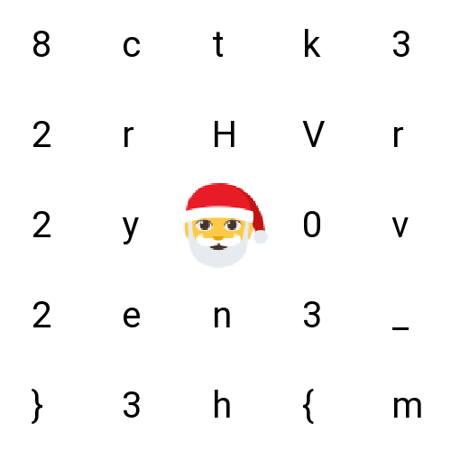

# [HV23.03] Santa's grille

We are given a weird image and after searching for a `grille cipher` as suspected from the challenge name, I found out that it is a cipher where you create holes in the so-called `grille` and rotate the `grille/ciphertext` after each reading.

As we know that the flag starts with `HV23{`, there are very few possibilities for the actual `grille`, so after playing around for a bit, I got the grille and the flag.

Flag: `HV23{m3rry_h8ckvent2023}`