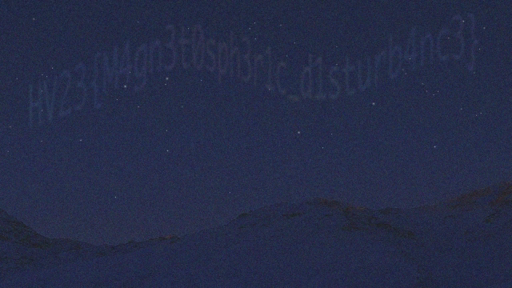

# [HV23.05] Aurora

## Introduction

Difficulty: Easy<br>
Author: monkey9508

The Northern Lights appeared at exceptionally low latitudes this year due to the high level of solar activity. But from Santa's grotto at the North Pole, it's not unusual at all to see them stretching across the sky. Snowball the elf tried to capture a video of the aurora for his Instagram feed, but his phone doesn't work well in poor light, and the results were rather grainy and disappointing. Is there anything you can do to obtain a clearer image?

## Solution

I've done a really similar challenge in COTM already, only that it was seperate images and not a noisy video, so I pulled out a solve script from COTM and got the flag after slight modification.

First I extracted the frames from the video using: `ffmpeg -i frames/frame%04d.png`

Then I ran the code below to average out the first 50 frames.

```py
from PIL import Image
import numpy as np

aurora = np.asarray(Image.open('frames/frame0001.png')).astype("uint32")
for i in range(1, 50):
    aurora += np.asarray(Image.open(f'frames/frame{i:04}.png'))
aurora = Image.fromarray((aurora//50).astype("uint8"))
aurora.show()
aurora.save('solve.png')
```



Flag: `HV23{M4gn3t0sph3r1c_d1sturb4nc3}`