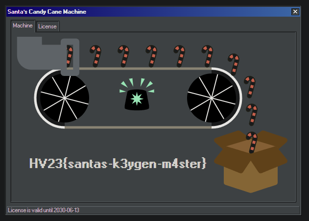

# [HV23.20] Santa's Candy Cane Machine

## Introduction

Difficulty: Hard<br>
Author: keep3r

As Santa wanted to start producing Candy Canes for this years christmas season, his machine wouldn't work anymore. All he got was some error message about an "expired license". Santa tried to get support from the manufacturer. Unfortunately, the company is out of business since many years.

One of the elves already tried his luck but all he got out of the machine was a .dll!

Can you help Santa license his Candy Cane machine and make all those kids happy for this years christmas?

## Solution

This was a really nice dotNET reversing challenge and after looking at the supplied DLL for quite some time, I noticed that you can just create CandyCaneLicense objects with a Serial, and if all internal checks pass, you get returned the license object which you can then use to validate the license itself and check to see if it is expired or not. 

So I did not really expect the following code to work, but after a few seconds of generating completely random Serials, I got a valid one. I then cleaned up the code to also generate a Premium Serial which I then used for [[HV23.H3] Santa's Secret](../H3/)

```c#
using CandyCaneLicensing;

var count = 0;
var random = new Random();
var possibleChars = "0123456789ABCDEFGHIJKLMNOPQRSTUVWXYZ";
var foundStandard = false;
var foundPremium = false;

while (true)
{
    var key = new List<string?>();

    for (var i = 0; i < 5; i++)
    {
        var cur = "";
        for (var j = 0; j < 5; j++)
        {
            cur += possibleChars[random.Next(possibleChars.Length)];
        }

        key.Add(cur);
    }

    var keyStr = string.Join("-", key);
    var license = CandyCaneLicense.Create(keyStr);
    count++;

    if (license != null)
    {
        if (license.IsExpired()) continue;
        
        switch (license.ProductType)
        {
            case ProductLicense.ProductTypes.Standard 
                or ProductLicense.ProductTypes.Advanced
                when !foundStandard:
                Console.WriteLine($"Generated {count} licenses");
                Console.WriteLine($"{license.ProductType}: {keyStr}");
                foundStandard = true;
                break;
            case ProductLicense.ProductTypes.Premium when
                license.ProductName == ProductLicense.ProductNames.CandyCaneMachine2000
                && !foundPremium:
                Console.WriteLine($"Generated {count} licenses");
                Console.WriteLine($"{license.ProductType}: {keyStr}");
                foundPremium = true;
                break;
        }
        
        if (foundStandard && foundPremium) break;
    }
}
```

```
Generated 732290 licenses
Standard: Q3WSY-C4W6T-D92RZ-FN2YR-UCD5A
Generated 2163465 licenses
Premium: S2TF7-A235L-Q55W9-KB6G4-ENSJ7
```

The Standard License gives us the Flag.



Flag: `HV23{santas-k3ygen-m4ster}`