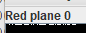
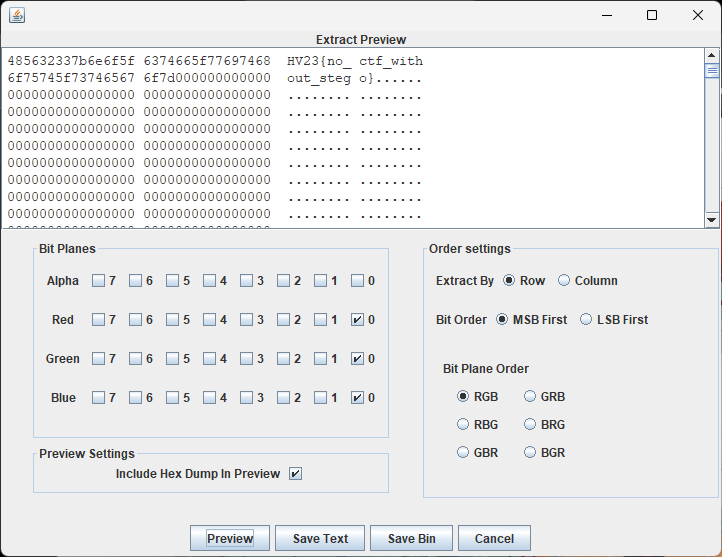

# [HV23.H1] Kringle's Secret

In the Challenge [[HV23.06] Santa should use a password manager](../06/) there was a 50% chance for the first Hidden Flag, so I opened the wallpaper in [StegSolve](https://github.com/Giotino/stegsolve)

After going through the bit-layers I noticed some small dots and dashes in the top-left corner:

Analyze > Data Extract > Tick LSB of R,G,B :

Hidden Flag: `HV23{no_ctf_without_stego}`