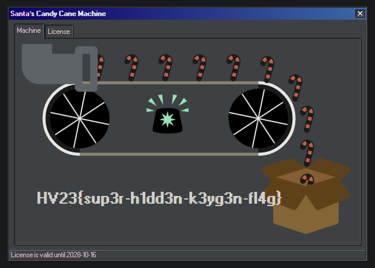

# [HV23.20] Santa's Candy Cane Machine

I've used the code from [[HV23.20] Santa's Candy Cane Machine](../20/) to generate licenses with different a different `productType` because I found that a bit weird, and after playing around a bit, I realized that when you generate a license with `productName = CandyCaneMachine2000` and `productType = Premium` we are rewarded with a Hidden Flag.

```
Generated 732290 licenses
Standard: Q3WSY-C4W6T-D92RZ-FN2YR-UCD5A
Generated 2163465 licenses
Premium: S2TF7-A235L-Q55W9-KB6G4-ENSJ7
```

The Premium License gives us the Hidden Flag.



Flag: `HV23{santas-k3ygen-m4ster}`